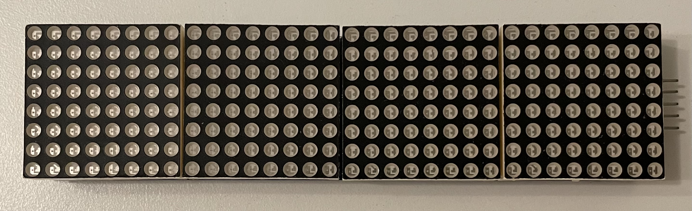

# Digital Clock

The clock is based on MAX7219 chipset:


## Build for Cubietruck's Armbian

First install linker and target. 
For linker it is much more convenient to set up `musl` since it has all libries on board.
`gnueabihf` has no C libs and requires them during build. This is a big problem for MacOS, so it might be possible to compilde the simplest programs only.

If you still want to set up `gnu` edition use:
```shell
$ brew install arm-linux-gnueabihf-binutils
$ rustup target add armv7-unknown-linux-gnueabihf
```

For those who want static link all libraries, it is [musl](https://wiki.musl-libc.org) project.
Unofficial prebuilt cross compilers are available at [musl.cc](https://musl.cc), or you can build them yourself (in about 10-15 minutes on a reasonably recent system) using musl-cross-make. This gives you a full, relocatable musl-targeting toolchain, with C++ support and its own library paths you can install third-party libraries into.

As for now (18.01.2022) there are no prebuilds for MacOS on musl.cc.
But it is possible to install FiloSottile prebuild via brew:

```shell
$ brew install FiloSottile/musl-cross/musl-cross
$ brew reinstall FiloSottile/musl-cross/musl-cross --without-x86_64 --with-arm-hf
```

You should notice both install and reinstall command are needed due to brew issue which prevents passing parameters `--without-x86_64 --with-arm-hf` for the install command. As the result `arm-linux-musleabihf-ld` linker appears.

Then install rust target
```shell
$ rustup target add armv7-unknown-linux-musleabihf
```

You should also put this text into the `<project root>/.cargo/config` file:
```conf
[build]
target = "armv7-unknown-linux-musleabihf"

[target.armv7-unknown-linux-musleabihf]
linker = "arm-linux-musleabihf-ld"
```

Then build:

```shell
$ cargo build --target armv7-unknown-linux-musleabihf
```

You can skip `--target` if you set it in `config` file:
```shell
$ cargo build
```